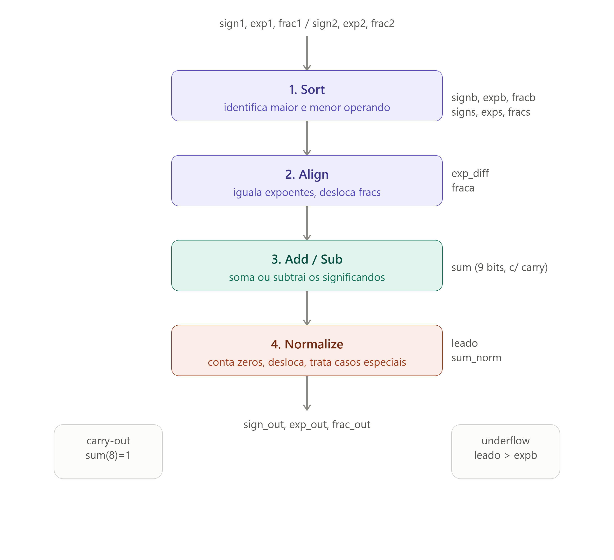
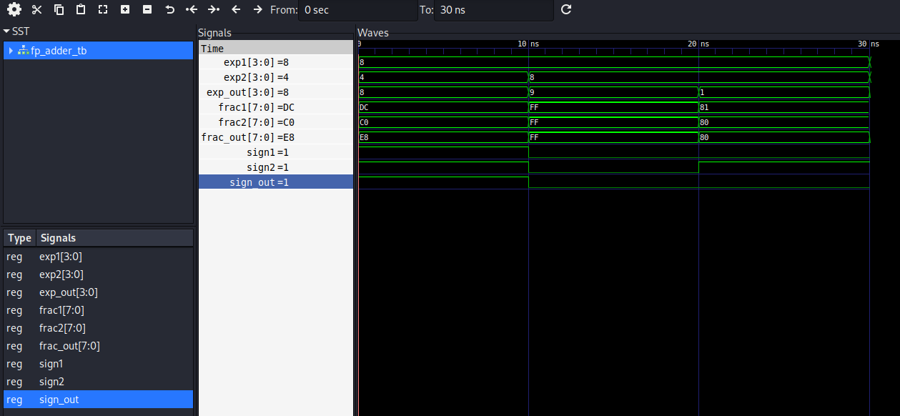
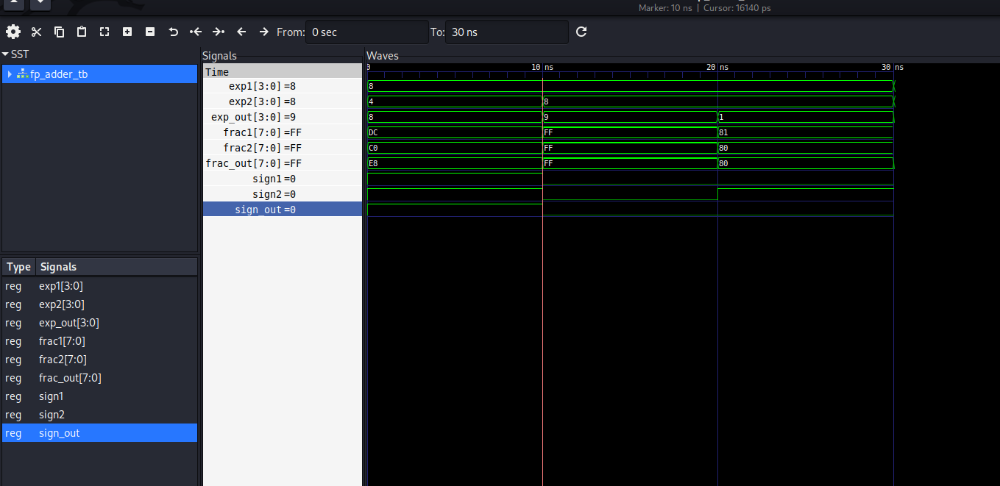
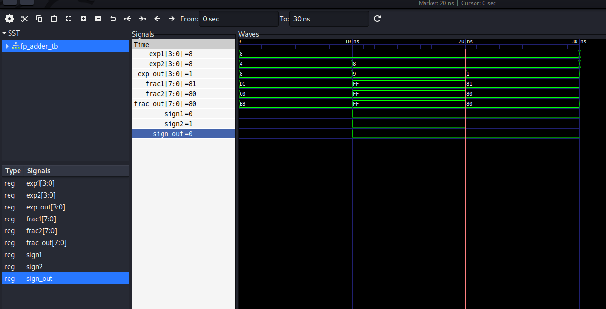
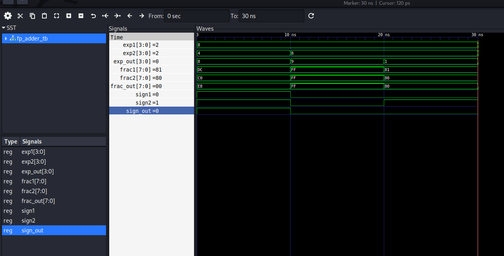
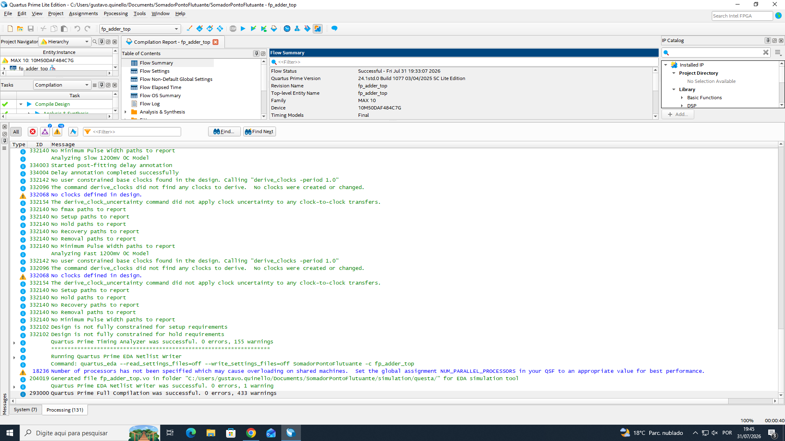
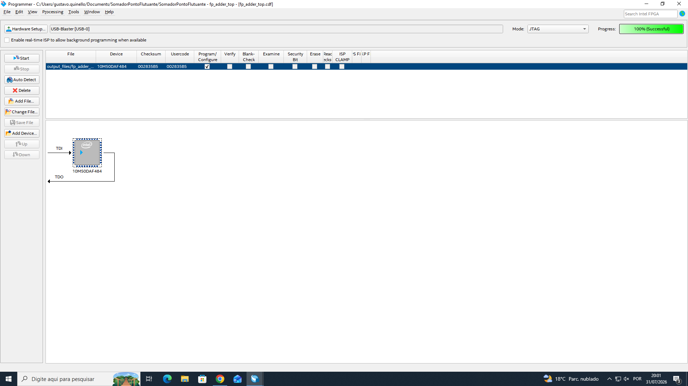
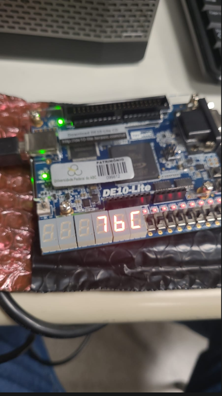
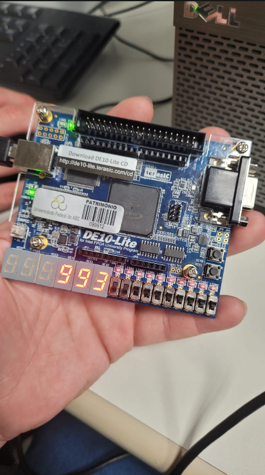
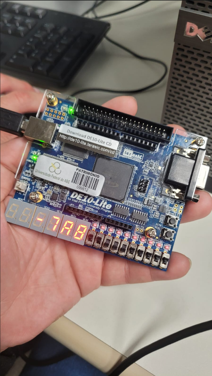

**template-somadorpf-vhdl**

# Tutorial: Implementação de Somador Ponto Flutuante na DE10-Lite

**Autores:** Gustavo Prado Quinello, Luan Chaves

**Disciplina:** Sistemas Digitais Q2.20026

**Data:** 10/08/2026

---

## Etapa 1

### 1. Objetivo do Projeto

Este projeto tem como objetivo adaptar o **somador de ponto flutuante simplificado de 13 bits** apresentado no livro *FPGA Prototyping by VHDL Examples* (Pong P. Chu), originalmente concebido para uma arquitetura de placa mais antiga, para a placa **Terasic DE10-Lite** (FPGA Intel MAX 10, dispositivo 10M50DAF484C7G).

O circuito recebe dois operandos em formato de ponto flutuante simplificado — 1 bit de sinal, 4 bits de expoente e 8 bits de significando — e realiza a soma seguindo o processo clássico de aritmética em notação científica: **ordenação** (identificação do maior e menor operando), **alinhamento** dos expoentes, **adição/subtração** dos significandos e **normalização** do resultado final.

O trabalho foi dividido em três frentes técnicas: (1) validação por simulação do algoritmo original em GHDL/GTKWave, sem nenhuma alteração de hardware; (2) adaptação da entidade de topo para rotear as entradas e saídas do circuito aos elementos físicos da DE10-Lite (chaves e displays de 7 segmentos), novamente validada por simulação; e (3) síntese física no Quartus Prime e teste do circuito na placa real. O uso de inteligência artificial (Claude) foi documentado ao longo de todo o processo, conforme detalhado na seção de Diário de Bordo de IA.

### 2. Descrição gráfica do funcionamento do sistema

O diagrama abaixo mostra o fluxo de dados pelos 4 estágios do `fp_adder`, usando os nomes reais dos sinais declarados no VHDL:



*(imagem exportada do widget de diagrama gerado durante o desenvolvimento — ver conversa anexada)*

**Tabela 1 — Codificador de zeros à esquerda (`leado`)**

Circuito do tipo *priority encoder*: percorre os bits de `sum` do mais significativo pro menos significativo e para no primeiro `1` encontrado.

| Condição (primeiro bit em 1) | `leado` | Zeros à esquerda |
|---|---|---|
| `sum(7) = '1'` | `000` | 0 |
| `sum(6) = '1'` | `001` | 1 |
| `sum(5) = '1'` | `010` | 2 |
| `sum(4) = '1'` | `011` | 3 |
| `sum(3) = '1'` | `100` | 4 |
| `sum(2) = '1'` | `101` | 5 |
| `sum(1) = '1'` | `110` | 6 |
| nenhum dos acima | `111` | 7 (ou todos zero) |

**Tabela 2 — Decisão de normalização (4º estágio)**

| Condição | `expn` | `fracn` | Significado |
|---|---|---|---|
| `sum(8) = '1'` | `expb + 1` | `sum(8 downto 1)` | Carry-out na adição — resultado excedeu 1 bit, desloca à direita |
| `leado > expb` | `"0000"` | `"00000000"` | Underflow — resultado pequeno demais pra representar normalizado, vira zero |
| caso contrário | `expb - leado` | `sum_norm` | Normalização padrão — desloca à esquerda pelo nº de zeros contados |

**Observação — comportamento de borda em caso de empate exato**

O 1º estágio (Sort) usa uma comparação estrita (`>`) entre `exp1 & frac1` e `exp2 & frac2`. Quando os dois operandos têm exatamente a mesma magnitude (empate), o operando 2 é sempre escolhido como "número grande", já que a condição `>` falha e o `else` é executado. Isso tem uma consequência sutil: no caso de subtração com cancelamento total (resultado = 0), o sinal do zero resultante (`sign_out`) segue o sinal do operando 2, podendo gerar um "zero negativo" quando `sign2 = '1'`. Não é um defeito — é o comportamento definido pelo próprio algoritmo original do livro —, mas evidencia que essa representação simplificada não trata `+0` e `-0` como equivalentes na lógica de seleção do 1º estágio.

---

## Etapa 2

### 3. Adaptações de Hardware (DE10-Lite)

A arquitetura original do livro (`fp_adder_test`, Listing 3.20) foi projetada para uma placa Xilinx mais antiga, com um display de 7 segmentos multiplexado no tempo (compartilhando 4 dígitos através de um módulo `disp_mux`) e um esquema de entrada baseado em 8 switches + 4 botões físicos. Essa arquitetura não é compatível diretamente com a DE10-Lite, que tem 10 switches, apenas 2 botões e 6 displays de 7 segmentos **independentes** (sem necessidade de multiplexação).

**O que mudamos no VHDL original:**

* **Removemos** a dependência das entidades `hex_to_sseg` e `disp_mux` do livro (não fornecidas no material e projetadas para multiplexação, desnecessária na DE10-Lite). Criamos uma função `hex_to_sseg` própria, combinacional, com a tabela de segmentos ativa em nível baixo específica da nossa placa.
* **Roteamos** o operando 1 como uma constante fixa no código (`sign1`, `exp1`, `frac1`), já que a DE10-Lite não tem switches suficientes para os 26 bits dos dois operandos simultaneamente.
* **Roteamos** o operando 2 inteiramente pelos 10 switches físicos (`SW`), distribuindo 1 bit de sinal, 4 bits de expoente e 5 bits do significando (os 2 bits menos significativos do significando ficam fixos em `"00"` por limitação de switches disponíveis).
* **Reorganizamos** a saída: em vez de multiplexar 4 dígitos num barramento de display único (como no livro), conectamos cada estágio do resultado a um display independente (`HEX0`–`HEX3`), simplificando a lógica de exibição.
* **Mantivemos** o núcleo do algoritmo (`fp_adder.vhd`) sem nenhuma alteração — a entidade original validada na Etapa 1 é instanciada dentro do wrapper (`fp_adder_top.vhd`) via `entity work.fp_adder`, garantindo que a lógica matemática já comprovada continue intacta.

**Por que hexadecimal na saída, e não decimal:** o expoente tem 4 bits (0-15), que cabem exatamente em 1 dígito hexadecimal; o significando tem 8 bits (0-255), que cabem exatamente em 2 dígitos hexadecimais (1 por nibble). Mostrar em decimal exigiria displays extras (2 dígitos para o expoente, 3 para o significando) e ainda não mostraria o valor real do número — apenas os campos binários internos em outra base. Optamos por hexadecimal por corresponder diretamente à estrutura de bits do formato, evitando a complexidade adicional de um conversor binário-decimal.

**Descrição gráfica do sistema**

O diagrama de blocos da seção 2 permanece válido em nível lógico/algorítmico — as adaptações desta etapa são de **roteamento de pinos e interface física**, não alteram o fluxo de dados entre os 4 estágios internos do `fp_adder`.

### 4. Evidências de Validação

#### Simulação

Abaixo, as imagens do funcionamento do 4º estágio (normalização), considerando os 4 casos detalhados no `fp_adder_tb.vhd`:

| Caso | Descrição | Print GTKWave |
|---|---|---|
| 1 | Soma com alinhamento de expoente |  |
| 2 | Carry-out na adição |  |
| 3 | Subtração com shift de normalização |  |
| 4 | Underflow para zero |  |

**Nota sobre o Caso 4:** como o `fp_adder` é um circuito puramente combinacional (sem clock), o resultado já está disponível no exato instante em que o estímulo é aplicado (t=30ns), permanecendo constante daí em diante. Por isso o arquivo `.vcd` não registra novos eventos após os 30ns — o print foi capturado com o marcador de tempo posicionado exatamente em t=30ns, mostrando `sign_out='0', exp_out="0000", frac_out="00000000"`, confirmando o underflow.

Validação adicional do wrapper `fp_adder_top` (Etapa 2), confirmando que o roteamento pelos switches e a decodificação para os displays não alteraram a lógica matemática:

```
Caso A (op2 desprezivel)      -> PASS
Caso B (carry-out)            -> PASS
Caso C (resultado negativo)   -> PASS
```

*(8/8 verificações PASS — ver `fp_adder_top_tb.vhd`)*

#### Código VHDL Final

O núcleo do algoritmo (`fp_adder.vhd`) permanece **idêntico ao original do livro**, validado na Etapa 1, e é apenas instanciado dentro do wrapper abaixo — nenhuma linha da lógica de sort/align/add-sub/normalize foi alterada.

O arquivo `fp_adder_top.vhd` é o que contém as adaptações de hardware. Os trechos mais relevantes estão marcados com `==> ADAPTACAO N` nos comentários, correspondendo aos itens listados na seção 3:

```vhdl
library ieee;
use ieee.std_logic_1164.all;
use ieee.numeric_std.all;

entity fp_adder_top is
    port(
        SW   : in  std_logic_vector(9 downto 0);
        HEX0 : out std_logic_vector(7 downto 0);
        HEX1 : out std_logic_vector(7 downto 0);
        HEX2 : out std_logic_vector(7 downto 0);
        HEX3 : out std_logic_vector(7 downto 0)
    );
end entity fp_adder_top;

architecture arch of fp_adder_top is

    signal sign1, sign2, sign_out : std_logic;
    signal exp1, exp2, exp_out     : std_logic_vector(3 downto 0);
    signal frac1, frac2, frac_out  : std_logic_vector(7 downto 0);

    -- ==> ADAPTACAO 1: decodificador de 7 segmentos proprio para a DE10-Lite
    -- (substitui o "hex_to_sseg" externo do livro, que dependia de
    --  multiplexacao via "disp_mux" — desnecessaria aqui, pois a DE10-Lite
    --  tem 6 displays HEX independentes)
    function hex_to_sseg(hex : std_logic_vector(3 downto 0)) return std_logic_vector is
        variable seg : std_logic_vector(7 downto 0);
    begin
        case hex is
            when "0000" => seg := "11000000"; -- 0
            when "0001" => seg := "11111001"; -- 1
            when "0010" => seg := "10100100"; -- 2
            when "0011" => seg := "10110000"; -- 3
            when "0100" => seg := "10011001"; -- 4
            when "0101" => seg := "10010010"; -- 5
            when "0110" => seg := "10000010"; -- 6
            when "0111" => seg := "11111000"; -- 7
            when "1000" => seg := "10000000"; -- 8
            when "1001" => seg := "10010000"; -- 9
            when "1010" => seg := "10001000"; -- A
            when "1011" => seg := "10000011"; -- b
            when "1100" => seg := "11000110"; -- C
            when "1101" => seg := "10100001"; -- d
            when "1110" => seg := "10000110"; -- E
            when others => seg := "10001110"; -- F
        end case;
        return seg;
    end function;

begin

    -- ==> ADAPTACAO 2: operando 1 fixado como constante em codigo
    -- (a DE10-Lite nao tem switches suficientes para os 26 bits dos
    --  dois operandos ao mesmo tempo — decisao de projeto do grupo)
    sign1 <= '0';
    exp1  <= "1000";
    frac1 <= "10101000";  -- valor fixo = +168.0 (0.65625 x 2^8)

    -- ==> ADAPTACAO 3: operando 2 totalmente roteado pelos 10 switches
    -- SW(9)          -> sinal
    -- SW(8 downto 5) -> expoente (4 bits)
    -- SW(4 downto 0) -> 5 bits mais significativos do significando
    --                   (2 bits menos significativos fixos em "00")
    sign2 <= SW(9);
    exp2  <= SW(8 downto 5);
    frac2 <= '1' & SW(4 downto 0) & "00";

    -- Nucleo do algoritmo: entidade original da Etapa 1, sem alteracoes
    fp_add_unit : entity work.fp_adder
        port map(
            sign1 => sign1, sign2 => sign2,
            exp1  => exp1,  exp2  => exp2,
            frac1 => frac1, frac2 => frac2,
            sign_out => sign_out, exp_out => exp_out, frac_out => frac_out
        );

    -- ==> ADAPTACAO 4: saida em displays independentes, sem multiplexacao
    -- (substitui o esquema multiplexado do livro por 4 displays diretos
    --  da DE10-Lite: HEX0-HEX3)
    HEX0 <= hex_to_sseg(frac_out(3 downto 0));
    HEX1 <= hex_to_sseg(frac_out(7 downto 4));
    HEX2 <= hex_to_sseg(exp_out);
    HEX3 <= "10111111" when sign_out = '1' else "11111111"; -- '-' ou apagado

end arch;
```

#### Como reproduzir este projeto (Quartus Prime + DE10-Lite)

Passo a passo completo para sintetizar e gravar o circuito na placa, partindo de um Quartus Prime Lite recém-instalado:

1. **Criar o projeto**: `File > New Project Wizard`. Escolha uma pasta de trabalho **gravável** (evite `Program Files`, pastas de rede ou pendrives protegidos — `Documents` costuma funcionar bem). Em **"Top-level design entity"**, digite `fp_adder_top` (não `fp_adder` — é a entidade de topo que tem os pinos físicos conectados).
2. **Project Type**: deixe `Empty project`. Na tela `Add Files`, não adicione nada ainda — clique `Next`.
3. **Family, Device & Board Settings**: Family = `MAX 10 (DA/DF/DC/AS/SC)`. No campo `Name filter`, digite `10M50DAF484C7G` e clique sobre o dispositivo na lista para selecioná-lo. `Next` → `Next` (EDA Tool Settings) → `Finish`.
4. **Adicionar os arquivos VHDL**: `Project > Add/Remove Files in Project...`. Adicione **os dois** arquivos: `fp_adder.vhd` e `fp_adder_top.vhd`. **Não adicione** os testbenches (`fp_adder_tb.vhd`, `fp_adder_top_tb.vhd`) — eles não são sintetizáveis (usam `wait for`, `report`) e quebram a compilação se entrarem no projeto.
5. **Importar as atribuições de pino**: `Assignments > Import Assignments`, aponte para o arquivo `DE10_Lite.qsf` fornecido pela disciplina. Ele já define os nomes `SW` e `HEX0`–`HEX3` compatíveis com o `fp_adder_top`.
6. **Compilar**: clique no triângulo azul (`Start Compilation`). Aguarde a mensagem `Quartus Prime Full Compilation was successful — 0 errors` (warnings são esperados, inclusive sobre os pinos `KEY` não utilizados).
7. **Conectar e gravar**: conecte a DE10-Lite via USB. Na aba `Tasks`, duplo clique em `Program Device (Open Programmer)`. Confirme `Mode: JTAG` e que `USB-Blaster [USB-0]` aparece detectado (senão, `Hardware Setup...` para selecionar manualmente). Marque `Program/Configure` na linha do arquivo `.sof` e clique `Start`. Aguarde `Progress: 100% (Successful)`.
8. **Testar**: com o operando 1 fixo em código (`+168.0`), o operando 2 é controlado pelos switches `SW9`(sinal)–`SW8-SW5`(expoente)–`SW4-SW0`(significando). O resultado aparece em `HEX3`(sinal)–`HEX2`(expoente)–`HEX1`,`HEX0`(significando), todos em hexadecimal.

---

## Etapa 3

### Funcionamento na Placa

O circuito foi sintetizado no Quartus Prime Lite (compilação `0 errors`) e gravado fisicamente na DE10-Lite via JTAG (`Progress: 100% Successful`). Testamos 3 combinações de switches, cada uma exercitando um comportamento distinto do 4º estágio (normalização), com a interpretação decimal completa do caminho de entrada (switches → decimal) e de saída (display → decimal) para cada caso:

**Print da compilação (0 errors):**



**Print da gravação bem-sucedida:**



---

**Caso 1 — Subtração com shift de normalização**

Switches: `SW9=1(cima), SW8=0, SW7=1, SW6=1, SW5=1, SW4=0, SW3=0, SW2=1, SW1=0, SW0=1`

| Etapa | Valor |
|---|---|
| Operando 1 (fixo) | `sign=0, exp=1000, frac=10101000` → **+168,0** (decimal) |
| Operando 2 (dos switches) | `sign=1, exp=0111, frac=10010100` → **−74,0** (decimal) |
| Soma esperada (decimal) | 168 + (−74) = **+94,0** |
| Resultado normalizado (binário) | `sign=0, exp=0111, frac=10111100` |
| Resultado no display (hex) | `HEX3` apagado, `HEX2=7, HEX1=B, HEX0=C` → **7BC** |
| Conferência | 0,10111100 × 2⁷ = 0,734375 × 128 = **94,0** ✅ bate com o esperado |



**Caso 2 — Carry-out na adição**

Switches: `SW9=0, SW8=0, SW7=1, SW6=1, SW5=1, SW4=1, SW3=1, SW2=1, SW1=1, SW0=1`

| Etapa | Valor |
|---|---|
| Operando 1 (fixo) | **+168,0** |
| Operando 2 (dos switches) | `sign=0, exp=0111, frac=11111100` → **+126,0** |
| Soma esperada (decimal) | 168 + 126 = **+294,0** |
| Resultado normalizado (binário) | `sign=0, exp=1001, frac=10010011` |
| Resultado no display (hex) | `HEX3` apagado, `HEX2=9, HEX1=9, HEX0=3` → **993** |
| Conferência | 0,10010011 × 2⁹ = 0,574219 × 512 = **294,0** ✅ bate com o esperado |



**Caso 3 — Resultado negativo (sinal aceso)**

Switches: `SW9=1, SW8=1, SW7=0, SW6=0, SW5=0, SW4=1, SW3=1, SW2=1, SW1=1, SW0=1`

| Etapa | Valor |
|---|---|
| Operando 1 (fixo) | **+168,0** |
| Operando 2 (dos switches) | `sign=1, exp=1000, frac=11111100` → **−252,0** |
| Soma esperada (decimal) | 168 + (−252) = **−84,0** |
| Resultado normalizado (binário) | `sign=1, exp=0111, frac=10101000` |
| Resultado no display (hex) | `HEX3` **aceso** (`-`), `HEX2=7, HEX1=A, HEX0=8` → **−7A8** |
| Conferência | −(0,10101000 × 2⁷) = −(0,65625 × 128) = **−84,0** ✅ bate com o esperado |



**Limitação conhecida — Caso 4 (underflow) não reproduzível fisicamente**

O underflow (Nível 4 da simulação) exige `leado > expb`. Como o operando 1 tem expoente fixo em 8 e quase sempre "vence" a comparação do estágio de Sort, o expoente do operando vencedor nunca fica abaixo de 8 nesse setup — e `leado` (máximo 7) nunca consegue superá-lo. Por isso, esse caso foi validado apenas por simulação (Etapa 1), não sendo replicável fisicamente com a estratégia de operando fixo adotada. Essa é uma limitação de projeto documentada, não um erro de implementação.

---

## Etapa 4

### 5. Diário de Bordo de IA

Utilizamos o **Claude (Anthropic)** para auxiliar na geração dos testbenches, na criação do wrapper de adaptação para a placa DE10-Lite e na estruturação da documentação. Abaixo está a análise crítica do uso da ferramenta.

**Prompts Utilizados (exemplos representativos):**

> "Otimo, extraia o codigo do pdf e monte o arquivo fp_adder_tb.vhd"

> "Nesse caso entao eu preciso da placa para continuar os testes?"

> "Como vamos proceder [com a adaptação para a DE10-Lite, já que só temos 10 switches e 2 botões]?"

*(conversa completa disponível em PDF anexado a este repositório)*

**O Erro da IA (Alucinação):**

Ao gerar o primeiro testbench para o `fp_adder_top.vhd` (`fp_adder_top_tb.vhd`), a IA calculou os padrões de segmento esperados para os displays de 7 segmentos (`HEX0`, `HEX1`, `HEX2`) **trocados** em relação à própria tabela de conversão (`hex_to_sseg`) que ela mesma havia escrito no código. Por exemplo, o valor esperado para o dígito "9" foi escrito incorretamente como o padrão do dígito "3" (`10000011` ao invés de `10010000`). O erro só foi detectado porque a IA **executou a simulação antes de entregar o arquivo** (rodando o GHDL num ambiente sandbox), e o resultado de `FAIL` no terminal expôs a inconsistência entre o valor esperado (escrito errado) e o valor real produzido pelo circuito (correto).

**A Correção Humana:**

A correção foi feita revisando, linha por linha, a tabela `hex_to_sseg` contra cada valor esperado no testbench, e recompilando com `ghdl -a` / `ghdl -r` até os 8 casos de verificação retornarem `PASS`. Esse episódio reforça que a validação por simulação (rodar o GHDL de fato, e não confiar cegamente no código gerado) foi o que garantiu a correção antes da entrega.

**Como o uso de IA contribuiu para o aprendizado do grupo:**

Além da geração de código, usamos a IA de forma ativa como ferramenta de estudo, não só de produção. Quando o grupo teve dificuldade em entender o mapeamento entre os switches físicos e o resultado exibido nos displays, a IA propôs duas abordagens complementares: (1) uma lista de exercícios progressiva, do nível mais básico (ler o formato de 13 bits) até o mais avançado (prever o comportamento dos switches na placa), com gabarito comentado; e (2) uma calculadora interativa que simula o circuito e permite testar combinações de switches antes de mexer na placa física. Isso mudou o processo de aprendizagem de "aceitar o resultado que aparece no display" para "prever o resultado antes de testar e confirmar o porquê matematicamente" — que é exatamente a habilidade avaliada no critério de interpretação de dados desta rubrica. Um segundo momento de aprendizagem relevante veio da investigação do motivo pelo qual a simulação do Caso 4 (underflow) não avançava além de 30ns no GTKWave: em vez de aceitar a explicação inicial, o grupo pediu a diagnose via terminal (`grep` nos timestamps do `.vcd`), o que levou à compreensão de que o comportamento era esperado (circuito combinacional responde instantaneamente ao estímulo), e não um erro de simulação.

### 6. Contribuição dos participantes

Taxonomia CRediT (https://credit.niso.org/):

* **Luan Chaves** — Investigação (testes práticos do circuito na placa DE10-Lite), Validação de dados e experimentos (conferência dos resultados obtidos em cada caso de teste), Recursos (criação e configuração do repositório no GitHub), Visualização (produção do vídeo de demonstração do projeto), Apresentação dos resultados para a docente.

* **Gustavo Prado Quinello** — Redação do manuscrito original (elaboração do README e da documentação técnica), Administração do Projeto (organização e manutenção do repositório), Curadoria de dados (estruturação e revisão do conteúdo produzido ao longo do desenvolvimento, incluindo o diário de bordo de IA).

---

## Bibliografia

Chu, P. P. *FPGA Prototyping by VHDL Examples*. Hoboken, NJ, John Wiley & Sons, Inc., 2008.

Intel/Altera. *Laboratory Exercise 1*. In https://ftp.intel.com/Public/Pub/fpgaup/pub/Teaching_Materials/current/Laboratory_Exercises/Digital_Logic/VHDL/lab1.pdf